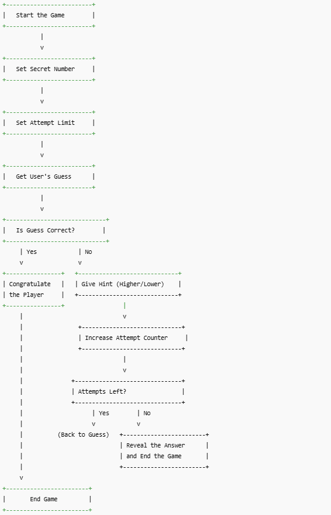

# 🎯 Number Guessing Game - Assignment

## Objective

Create a Python console application that challenges the user to guess a randomly selected number between 1 and 100 within a limited number of attempts.

## Requirements

- Use the `random` module to generate the number.
- Prompt the user to input a guess.
- Provide feedback whether the guess is too low or too high.
- Limit the number of guesses to 5.
- Print a success message when the correct number is guessed.
- End the game when the user exceeds the maximum number of attempts.

## Features

- Random number generation between 1 and 100
- Feedback for every incorrect guess
- Limits guesses to a maximum of 5 attempts
- Handles both win and loss scenarios with appropriate messages

## Bonus (Optional)

- Add input validation for non-integer inputs
- Let the user play multiple rounds
- Track the number of games won/lost

## Deliverables

- Python script file (e.g., `guessing_game.py`)
- A README with instructions on how to run the game
